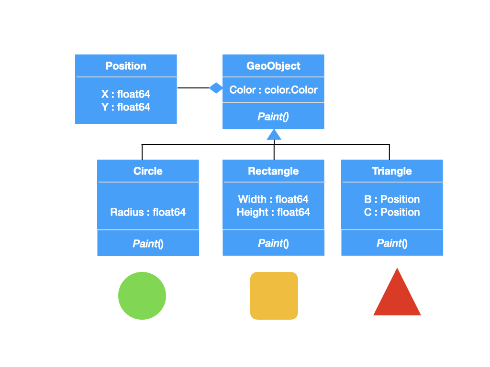

# Exercise 3 - OOP in Go

If you do not finish during the lecture period, please finish it as homework.

## Stack 3.1 (Containers)

Write a generic LIFO container (stack) for all types by using interface{} as dynamic type by using the OOP approach. 
The stack should have at least two methods:

- Push(object)
- Pop()

Use the array append function for Push and the slices feature for Pop 

## Exercise 3.2 - Interfaces, Polymorphism and Embedding

The image shows a typical UML design with inheritance, aggregation and polymorph methods.



Implement this design as close as possible to the design in Go:

- The `Paint()` method should print the names and values of the fields to the console
- Allocate an array of polymorph objects and call Paint() in a loop

## Exercise 3.3 - Mail Component and Service Locator

Implement the following interface:

```go
type Sender interface {
  // Send a mail to a given address with a subject and text.
  Send(message Message) error
}
```

Implement the interface and write a client. The implementation should be provided by
a simple self made service locator registry:

```go
// Create an implementation for the mail.Sender interface
var sender = Registry.Get("mail.Sender").(mail.Sender)

email := mail.Message{To: to, Subject: subject, Text: text}
return sender.Send(email)
```

Interface, client and implementation should be in separate packages.
